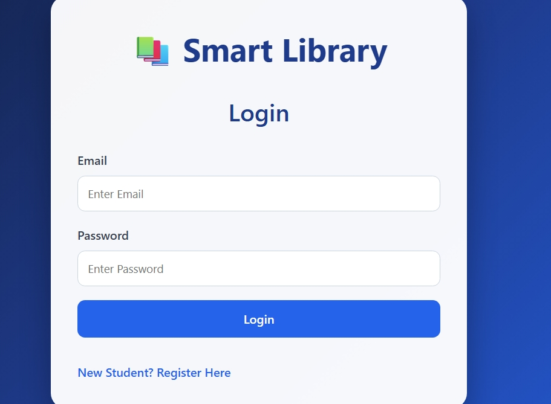
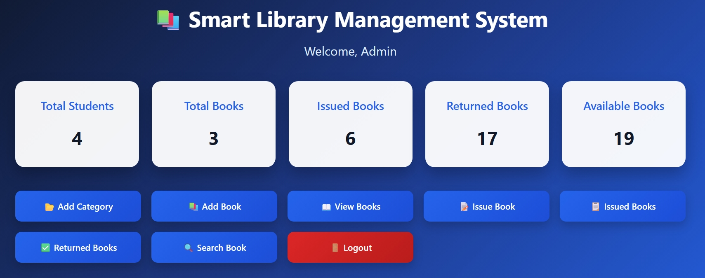
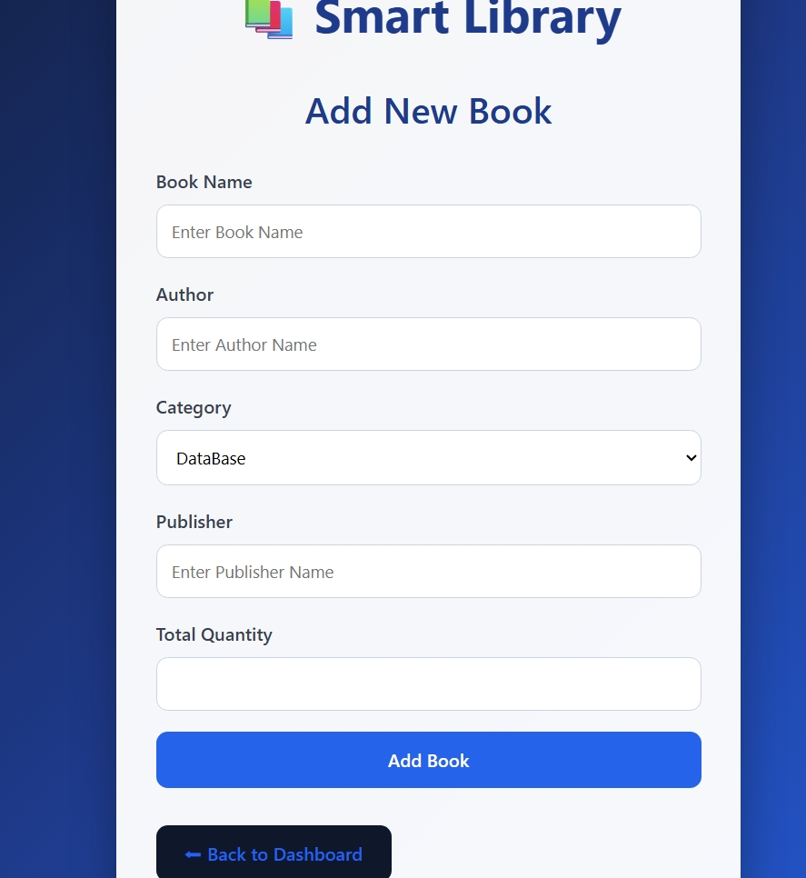
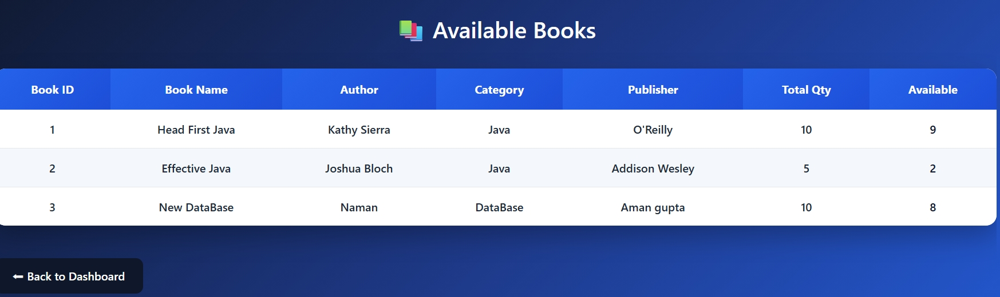

## 📸 Project Screenshots

### Login Page




<br><br>


### Admin Dashboard




<br><br>


### Add Book




<br><br>


### Issue Book




<br><br>


📚 Smart Library Management System


A Java Full Stack Library Management System developed using JSP, Servlets, JDBC, MySQL, HTML, CSS, and JavaScript.

---

## 🚀 Features

- 🔐 Admin & Student Login
- 👨‍🎓 Student Registration
- 📚 Book Management
- 📂 Category Management
- 📖 Book Issue
- ✅ Book Return
- 🔍 Search Books
- 📊 Admin Dashboard
- 📈 Student Dashboard
- 💾 MySQL Database Integration

---

## 🛠️ Tech Stack

### Backend
- Java
- JDBC
- JSP
- Servlets

### Frontend
- HTML
- CSS
- JavaScript

### Database
- MySQL

### Server
- Apache Tomcat 10

### IDE
- Eclipse IDE

---

## 📂 Project Structure

```
Smart-Library-Management-System

├── src
│   ├── controller
│   ├── dao
│   ├── dto
│   ├── service
│   └── util
│
├── src/main/webapp
│   ├── css
│   ├── images
│   ├── jsp files
│   └── WEB-INF
│
└── README.md
```

---


## 💻 Installation

1. Clone the repository

```
git clone https://github.com/Sarvesh-1122/Smart-Library-Management-System.git
```

2. Import the project into Eclipse.

3. Configure Apache Tomcat.

4. Configure MySQL Database.

5. Run the project.

---

## 👨‍💻 Author

**Sarvesh Yadav**

GitHub

https://github.com/Sarvesh-1122

LinkedIn

https://www.linkedin.com/in/sarvesh-yadav-131b46317/

LeetCode

https://leetcode.com/u/Sarvesh_Coder/

Hackerrank

https://www.hackerrank.com/profile/sarveshyadav_211

codechef

https://www.codechef.com/users/sarvesh888708

---

## ⭐ If you like this project, give it a Star.